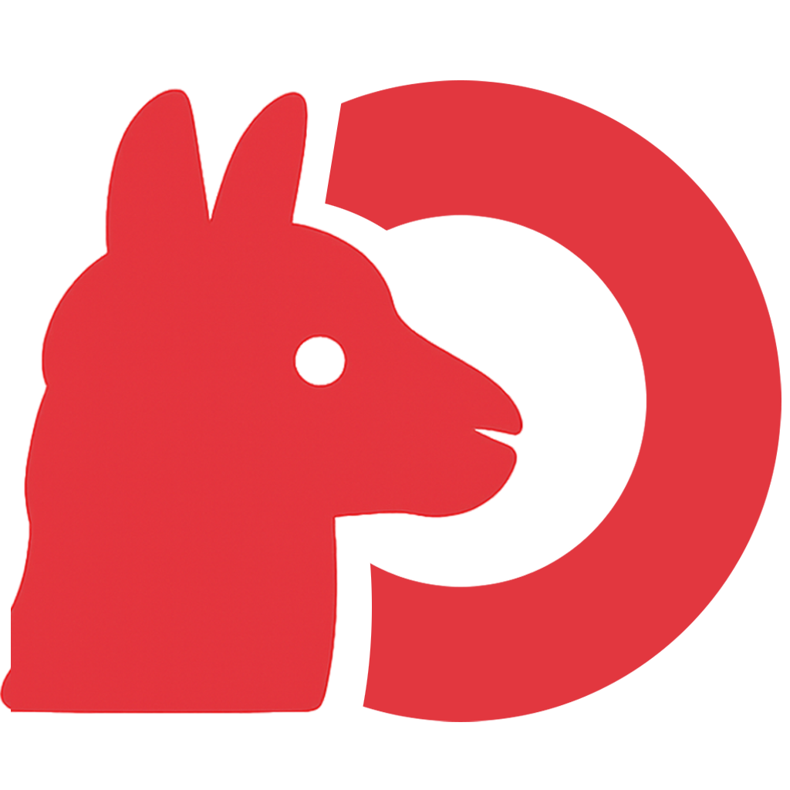

# OllamaOnDemand

<p align="center">
  
</p>

A ChatGPT-style web interface for running large language models (LLMs) on HPC clusters. Built on [Gradio](https://www.gradio.app/) and [Ollama](https://ollama.com/), OllamaOnDemand is designed from the ground up for HPC environments and natively supports [Open OnDemand](https://openondemand.org/) subpath routing.

---

## Features

- **Multi-session chat** — Create, rename, export, and delete independent chat conversations. Chat titles are auto-generated using a small background model.
- **Multimodal inputs** — Attach images, plain-text files, and PDFs to your messages. PDFs are automatically converted to images for vision-capable models.
- **Thinking / reasoning model support** — `<think>` blocks from reasoning models are rendered in a collapsible panel so the final answer stays readable.
- **In-UI model management** — Install or remove models from [ollama.com](https://ollama.com) directly from the Settings panel, with live download progress. Supports read-only shared model directories (admin-maintained model pools).
- **Customizable inference parameters** — Fine-tune temperature, top-p, top-k, context window, GPU layers, Mirostat, and many more parameters per session without touching the command line.
- **Persistent state** — Chat history and user settings are saved to a configurable work directory and restored on the next launch.
- **HPC-ready container** — Ships with an official [Singularity](https://sylabs.io/) recipe built on top of the `ollama/ollama` Docker image, including Miniforge Python and all required Python packages.
- **Open OnDemand integration** — A ready-to-use OOD batch-connect app template is included (`examples/ood-app`).

---

## Requirements

| Dependency | Version |
|---|---|
| Python | ≥ 3.10 (latest recommended) |
| Ollama | latest |
| gradio | 5.49.1 |
| ollama (Python) | 0.6.1 |
| humanize | any |
| PyMuPDF | any |
| binaryornot | any |

GPU access is strongly recommended for reasonable inference performance.

---

## Quick Start (local)

### 1. Install Ollama

Follow the [Ollama installation guide](https://ollama.com/download) for your platform.

### 2. Install Python dependencies

```bash
pip install gradio==5.49.1 ollama==0.6.1 humanize PyMuPDF binaryornot
```

### 3. Pull a model

```bash
ollama pull llama3.2
```

### 4. Launch OllamaOnDemand

```bash
python main.py
```

Open your browser at **http://localhost:7860**.

---

## Command-Line Options

```
python main.py [OPTIONS]
```

| Option | Default | Description |
|---|---|---|
| `--host` | `0.0.0.0` | Host for the Gradio web server |
| `--port` | `7860` | Port for the Gradio web server |
| `--root-path` | _(none)_ | Root path / subpath for the web interface (required for Open OnDemand) |
| `-w`, `--workdir` | `~/.ollama/ondemand` | Directory where OllamaOnDemand stores chat history, settings, and cache |
| `--ollama-host` | `127.0.0.1:11434` | Address of the Ollama backend server |
| `--ollama-models` | `~/.ollama/models` | Path to the Ollama model directory |
| `--title-model` | `gemma3:4b` | Small model used for fast auto-generation of chat titles |
| `--debug` | _(off)_ | Enable debug mode |
| `-v`, `--version` | | Print version and exit |

### Example

```bash
python main.py \
    --port 8080 \
    --workdir /scratch/$USER/ollama_ondemand \
    --ollama-models /shared/models/ollama \
    --title-model gemma3:4b
```

---

## Singularity Container

A Singularity definition file is provided at `container/singularity.def`. The container bundles Ollama, Miniforge Python, and all Python dependencies.

### Build the container

> **Important:** The build must be run from inside the `container/` directory so that the `%files` section can copy the project files correctly.

```bash
cd container
sudo singularity build ollamaondemand.sif singularity.def
```

### Run the container

```bash
singularity run --nv ollamaondemand.sif [OPTIONS]
```

Pass the same command-line options as the Python launcher. The `--nv` flag enables NVIDIA GPU access.

---

## Open OnDemand Integration

A complete Open OnDemand batch-connect app template is located in `examples/ood-app/`. It is designed as a starting point — each HPC system is configured differently, so some adaptation will be required.

### Key files

| File | Purpose |
|---|---|
| `manifest.yml` | App metadata (name, category, description) |
| `form.yml.erb` | Job submission form (allocation, queue, duration, work directory) |
| `submit.yml.erb` | Slurm submission parameters |
| `template/script.sh.erb` | Batch script: finds a free port, starts the Singularity container |
| `view.html.erb` | Connect button shown to the user once the job is running |

### Minimal setup steps

1. Copy `examples/ood-app/` to your OOD apps directory.
2. Edit `form.yml.erb`: set your cluster name and update the queue/partition list.
3. Edit `template/script.sh.erb`: set the path to `ollamaondemand.sif` and the shared model directory (if any).
4. Edit `manifest.yml`: replace `[INSERT ORGANIZATION NAME]` with your institution name in the Terms of Use section.

---

## Directory Layout

```
OllamaOnDemand/
├── main.py               # Application entry point and Gradio UI
├── arg.py                # Command-line argument definitions
├── chatsessions.py       # Chat session management (load/save/CRUD)
├── usersettings.py       # User settings persistence
├── usersettings.json     # Inference parameter definitions for the Settings panel
├── multimodal.py         # Multimodal file handling (images, text, PDF)
├── remotemodels.py       # Fetches available models from ollama.com
├── grblocks.css          # Custom Gradio CSS
├── head.html             # Custom HTML injected into the page <head>
├── images/
│   └── logo.png          # App logo
├── container/
│   └── singularity.def   # Singularity container recipe
└── examples/
    ├── local-setup/      # Notes for a local / standalone setup
    └── ood-app/          # Open OnDemand batch-connect app template
```

---

## License

See [LICENSE](LICENSE) for details.

---

## Author

**Dr. Jason Li** — Louisiana State University HPC  
jasonli3@lsu.edu
